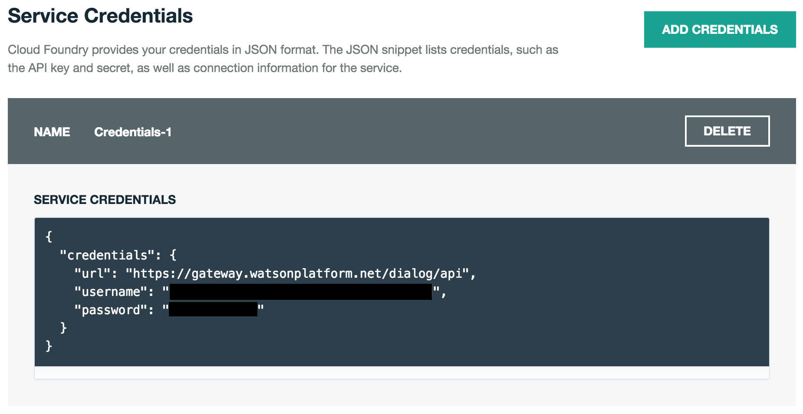
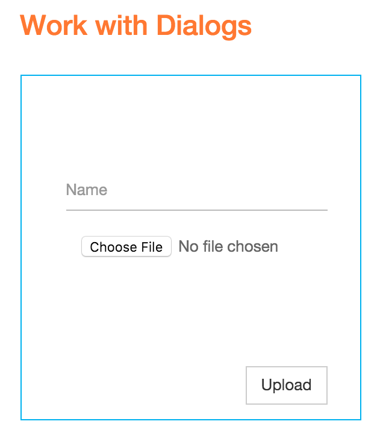
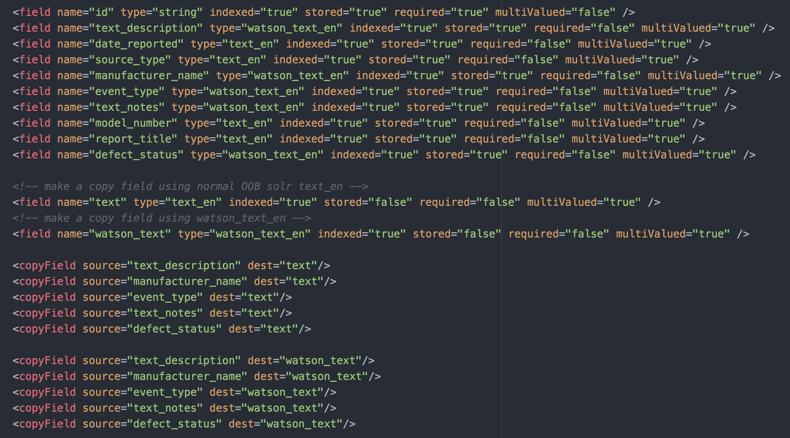
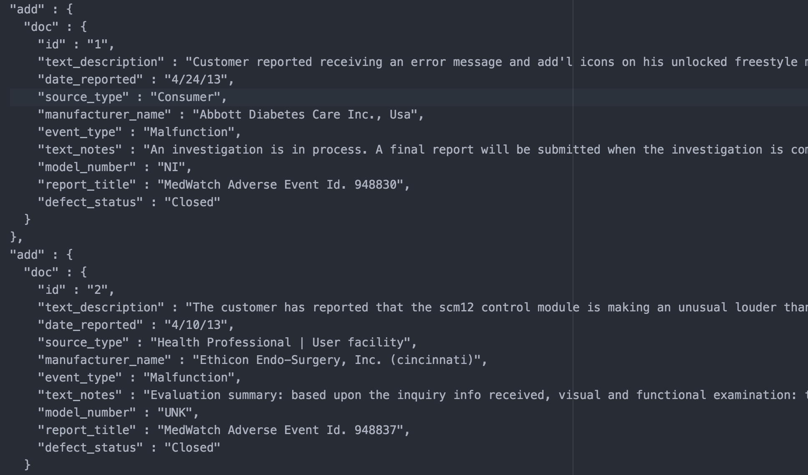
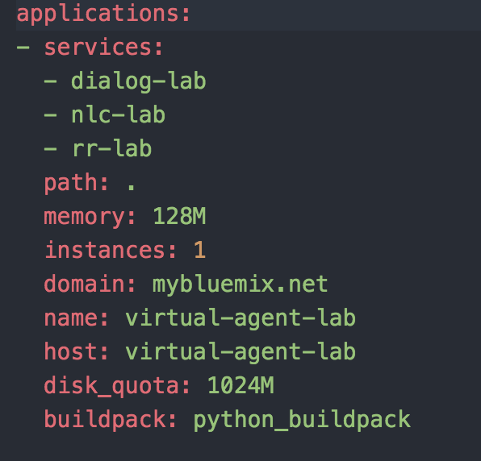
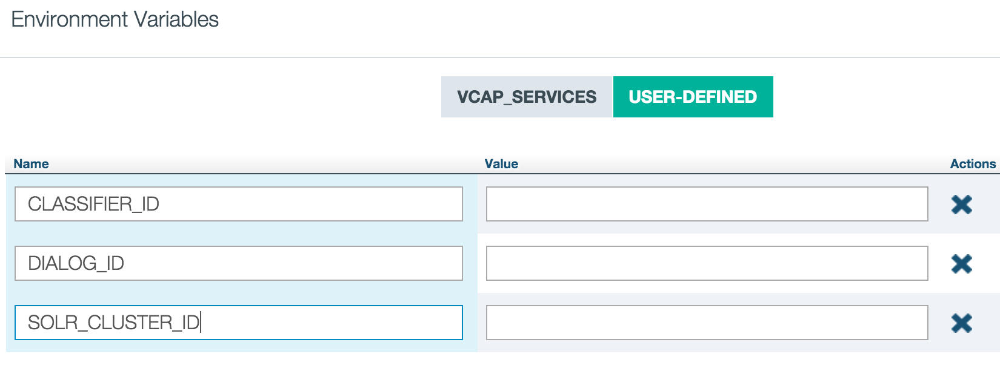
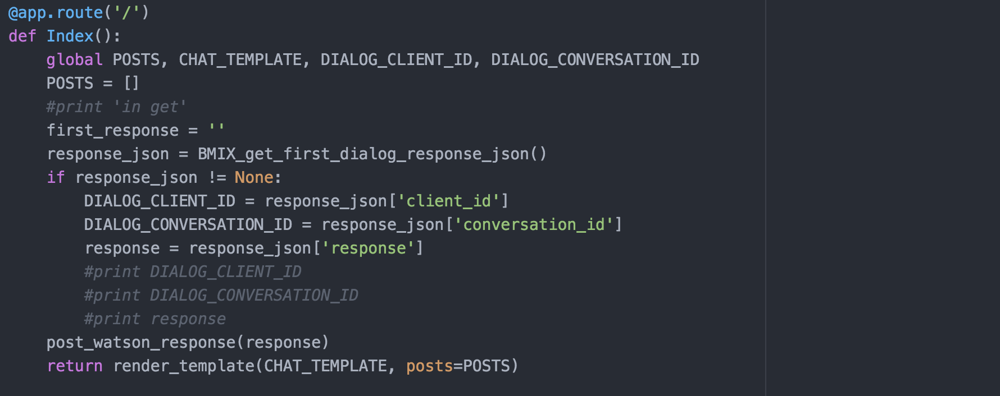
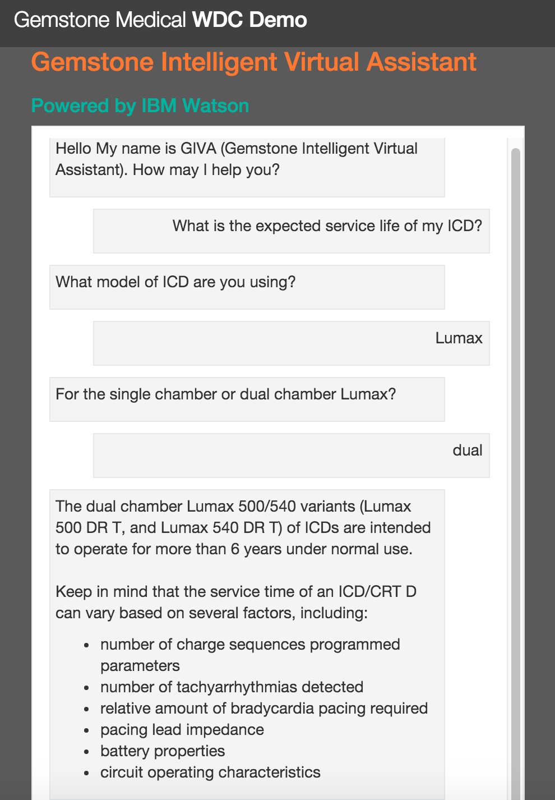

# Architecture Workshop Hands On Labs - Virtual Agent

 Virtual Agent is a self-service engagement application that helps a user access support information and troubleshoot issues in a self-service fashion. It follows an interaction between an end user and a virtual agent for a fictional company called Gemstone Medical. For a list of the interactions that are included check out SCRIPT.md

 This lab uses the [Dialog][dialog_service], [Natural Language Classifier][nlc_service], and [Retrieve and Rank][rr_service] services. It was designed to be completed during the Ecosystem Architecture Workshop. For additional sample apps check out the [Watson Application Starter Kits] (http://www.ibm.com/smarterplanet/us/en/ibmwatson/developercloud/application-starter-kits.html)

  Let's get started.

## Creating an IBM Bluemix Account

  1. Go to [https://ace.ng.bluemix.net/](https://ace.ng.bluemix.net/)
  2. Create a Bluemix account if required.
  3. Log in with your IBM ID (the ID used to create your Bluemix account)

**Note:** The confirmation email from Bluemix mail take up to 1 hour.

## Create Watson services

  1. Create the Dialog, Natural Language Classifier, and Retrieve and Rank services in Bluemix.

  2. Capture the name and credentials for each service.

  

## Configure and test the dialog service

  **Note:** Steps 1-5 are optional. They show you how to set up and use the separate dialog test tool.

  1. Test the sample dialog flow by deploying the [Dialog Tool](https://github.com/watson-developer-cloud/dialog-tool?cm_mc_uid=79962573693514539991735&cm_mc_sid_50200000=1456761145). While the dialog tool is not required to build this application, it will help you manage and test your dialog flows going forward.

  2. Follow the instructions in the Dialog Tool README to bind your dialog service to the dialog tool.

  3. Upload the gem_dialog.xml flow file through the dialog tool UI.

  

  4. Experiment with "Have a Conversation" to see how the dialog flow works in practice.

  **Note:** The Natural Language Classifier is not implemented in the dialog tool so the flow will not work as an end-user would expect. However you can observe the machine to machine interaction that will exist between the dialog service and application.

  5. Unbind your Dialog Service from the dialog tool application and bind it to your Virtual Agent application.

  6. Create a new dialog flow by calling the create dialog API endpoint with the gem_dialog.xml flow file.

  [Create Dialog API Reference](http://www.ibm.com/smarterplanet/us/en/ibmwatson/developercloud/dialog/api/v1/#create-dialog)

  7. Capture the Dialog ID.

## Train and test the Natural Language Classifier service

  1. Create a new classifier instance with the gem_training_questions.csv training file.

  [Create Classifier API Reference](http://www.ibm.com/smarterplanet/us/en/ibmwatson/developercloud/natural-language-classifier/api/v1/#create_classifier)

  2. Capture the Classifier ID.

## Configure, train and test the Retrieve and Rank service

  1. Create a Solr cluster and capture Cluster ID

  [Create Cluster API Reference](https://www.ibm.com/smarterplanet/us/en/ibmwatson/developercloud/retrieve-and-rank/api/v1/#create_solr_cluster)

  2. Review the contents of the gem_solr_config directory. Review schema.xml and notice the fields that are defined. When the cluster is READY, upload the solr config gemstone_solr_config.zip to your solr cluster.

  [Upload Config API Reference](https://www.ibm.com/smarterplanet/us/en/ibmwatson/developercloud/retrieve-and-rank/api/v1/#upload_config)

  

  3. Create collection.

  [Create Collection API Reference](https://www.ibm.com/smarterplanet/us/en/ibmwatson/developercloud/retrieve-and-rank/api/v1/#create_solr_collection)

  4. Review the sample solr documents in fda_medwatch_docs.json. Notice how each document contains the fields that are defined in the schema.xml. Notice how the structure of the json file follows standard Solr API construction for adding and committing documents. Index the documents.

  [Index Documents API Reference](https://www.ibm.com/smarterplanet/us/en/ibmwatson/developercloud/retrieve-and-rank/api/v1/#index_doc)

  

  5. Create and train ranker. TBD

  [Create Ranker API Reference](https://www.ibm.com/smarterplanet/us/en/ibmwatson/developercloud/retrieve-and-rank/api/v1/#create_ranker)

## Deploy application

  1. Download the application zip file from this [git repository](https://github.com/cackerso/virual-agent-lab).

  2. Ensure that you have the [Cloud Foundry CLI installed](https://console.ng.bluemix.net/docs/starters/install_cli.html).

  3. Modify the manifest.yml file to include a unique application name and the name of the services you created

  

  4. Log in to Bluemix
      cf login

  5. From the app root directory, push app to Bluemix. This will copy all files to Bluemix and bind your services to the application.
      cf push <application name>

  6. Go to Environment Variables in Bluemix and create 3 user-defined environment variables: DIALOG_ID, CLASSIFIER_ID and SOLR_CLUSTER_ID. Input the IDs that you captured when configuring these services.

  

  Because you have defined environment variables, you do not need to hardcode credentials or IDs in the application code itself, however you should take note of where this can be done.

  7. Walk the application code, specifically welcome.py, dialog.py, nlc.py, and randr.py. Start with the initial GET request in the Flask server code and follow each function call.

  

## Modify the dialog xml and classifier to create a new troubleshooting flow

  1. There are 3 simple dialog flows within the Live Content folder in the dialog xml: Product_Info, Troubleshooting and Issue_lookup. Create a new folder in the dialog xml called Troubleshooting_2.

  2. On a whiteboard, write a simple dialog flow to represent a new issue that an end user might need to troubleshoot.

  3. Work with your Solutions Architect to add that flow to your dialog xml. Update your dialog service with your new dialog xml and update your DIALOG_ID in Environment Variables.

  4. Add a new class to your NLC training data to represent the user intent that enters this new flow and train your classifier. Update the CLASSIFIER_ID in Environment Variables.

## Test

  Once your application is deployed, follow the script in SCRIPT.md. Test your new dialog flow.

  

# Congratulations

You have completed the Virtual Agent Lab! You are now ready to build your own virtual agent application powered by Watson :bowtie:

[bluemix]: https://console.ng.bluemix.net/
[wdc_services]: http://www.ibm.com/smarterplanet/us/en/ibmwatson/developercloud/services-catalog.html
[dialog_service]: http://www.ibm.com/smarterplanet/us/en/ibmwatson/developercloud/personality-insights.html
[nlc_service]: http://www.ibm.com/smarterplanet/us/en/ibmwatson/developercloud/personality-insights.html
[rr_service]: http://www.ibm.com/smarterplanet/us/en/ibmwatson/developercloud/personality-insights.html
